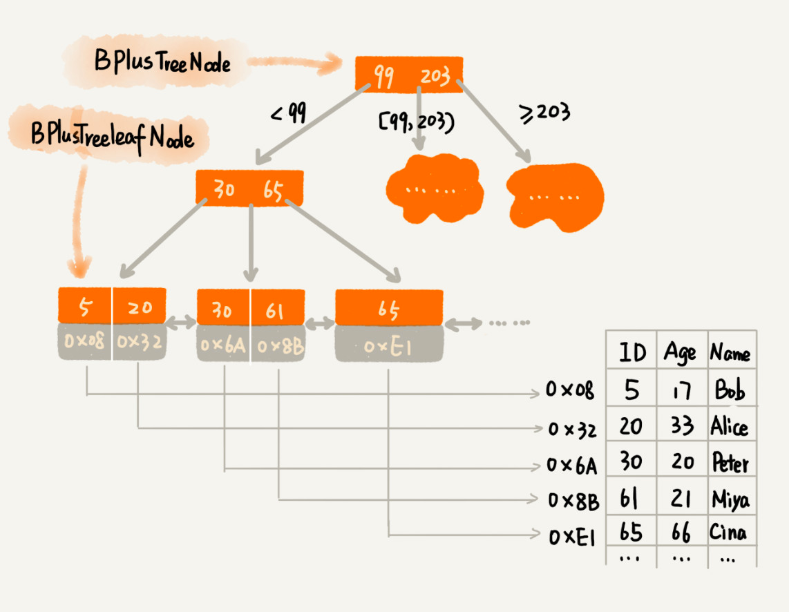
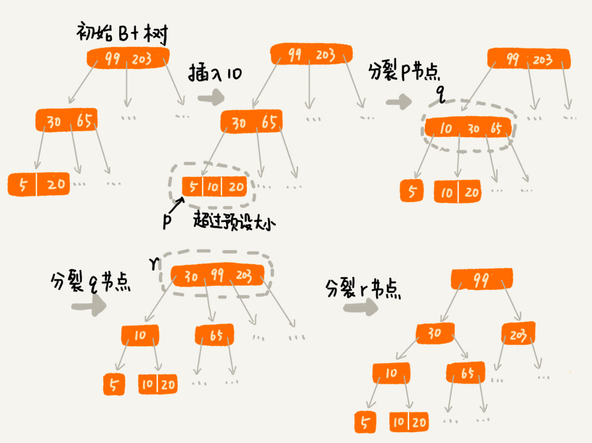

## MySQL 为什么使用 B+ 树来作索引，对比 B 树它的优点和缺点是什么？

### B+ 树和 B 树的定义？
- **B树定义**：
  BTree是平衡搜索多叉树，设树的度为2d（d>1），高度为h，那么BTree要满足以一下条件：
    - 每个叶子结点的高度一样，等于h；
    - 每个非叶子结点由n-1个key和n个指针point组成，其中d<=n<=2d,key和point相互间隔，结点两端一定是key；
    - 叶子结点指针都为null；
    - 非叶子结点的key都是[key,data]二元组，其中key表示作为索引的键，data为键值所在行的数据；
- **B+树定义**：
  B+Tree是BTree的一个变种，设d为树的度数，h为树的高度，B+Tree和BTree的不同主要在于：
    - B+Tree中的非叶子结点不存储数据，只存储键值；
    - B+Tree的叶子结点没有指针，所有键值都会出现在叶子结点上，且key存储的键值对应data数据的物理地址；
    - B+Tree的每个非叶子节点由n个键值key和n个指针point组成；
      
      
### B+ 树和 B 树的区别？
- 1. 查找结点的时间复杂度：
    - B 树非叶子结点和叶子结点都存储数据,因此查询数据时，时间复杂度最好为 O(1),最坏为 O(log n)。
    - B+ 树只在叶子结点存储数据，非叶子结点存储关键字，且不同非叶子结点的关键字可能重复，因此查询数据时，时间复杂度固定为 O(log n)。
- 2. 查找的方法：
    - B+ 树叶子结点之间用链表相互连接，因而只需扫描叶子结点的链表就可以完成一次遍历操作；
    - B树只能通过中序遍历。
### 为什么 B+ 树比 B 树更适合应用于数据库索引？
- 1. B+ 树更加适应磁盘的特性，相比 B 树减少了 I/O 读写的次数。
    - 由于索引文件很大因此索引文件存储在磁盘上，B+ 树的非叶子结点只存关键字不存数据，因而单个页可以存储更多的关键字，即一次性读入内存的需要查找的关键字也就越多，磁盘的随机 I/O 读取次数相对就减少了。
- 2. B+ 树的查询效率相比B树更加稳定
    - 由于数据只存在在叶子结点上，所以查找效率固定为 O(log n)。
- 3. B+ 树利于扫库和范围查询
    - B+ 树叶子结点之间用链表有序连接，所以扫描全部数据只需扫描一遍叶子结点，
    - B 树由于非叶子结点也存数据，所以只能通过中序遍历按序来扫。也就是说，对于范围查询和有序遍历而言，B+ 树的效率更高。

- [x] [B树模拟网站](https://link.jianshu.com/?t=https%3A%2F%2Fwww.cs.usfca.edu%2F%7Egalles%2Fvisualization%2FBTree.html)
